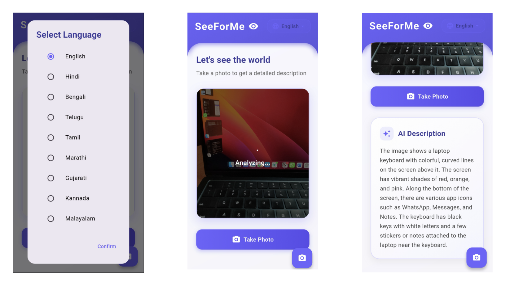
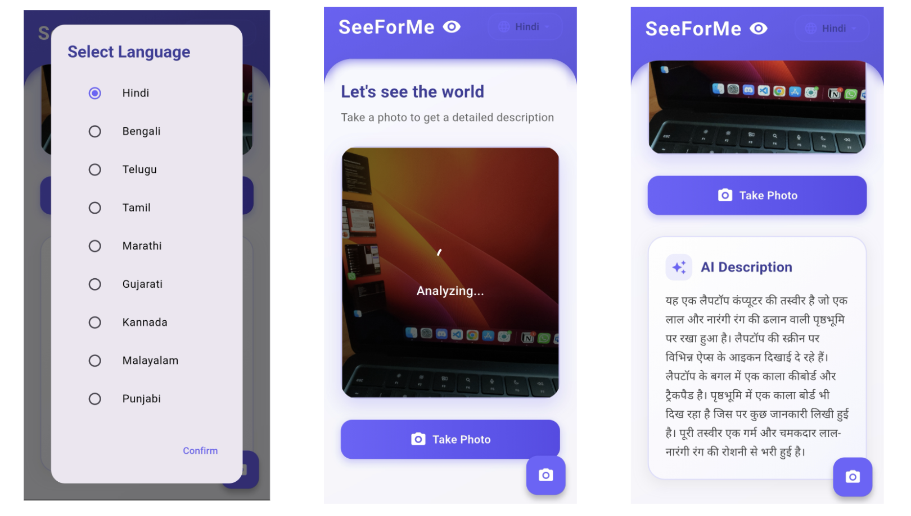
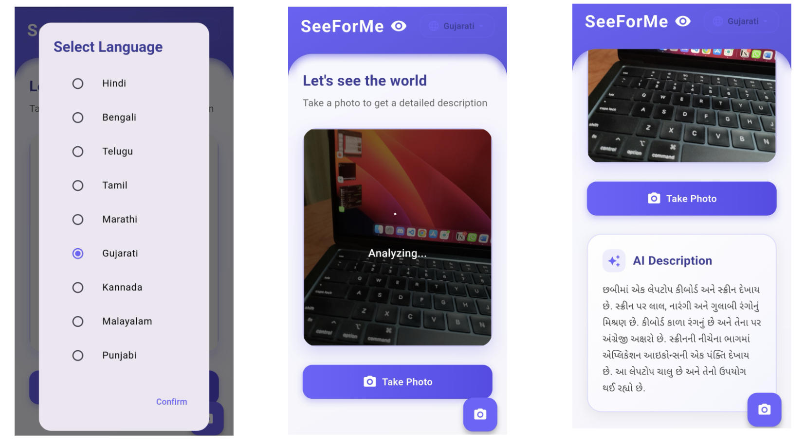

# 👁️ SeeForMe

> **Empowering independence for visually impaired individuals through real-time, multilingual scene understanding with audio feedback.**

---

## 🌟 Overview

Visually impaired individuals often struggle to identify objects and navigate their surroundings independently.
While existing solutions exist, they are often:

* 🌐 Limited to **English only**
* ⚠️ Difficult to operate without visual interaction
* 🚫 Lacking **support for Indian languages**
* ❌ Not optimized for **simple, accessible controls**

**SeeForMe** bridges this gap by providing:

✅ Real-time **object & scene recognition**
✅ **Audio feedback** in multiple Indian languages
✅ **Accessible navigation** via simple controls (like volume buttons)
✅ A **user-friendly mobile app** designed with inclusivity at its core

---

## 🎯 Key Features

* 🔍 **Object Detection & Scene Understanding** – AI-powered recognition of surroundings
* 🗣️ **Multilingual Audio Output** – Support for Indian languages (Hindi, Marathi, Tamil, etc.)
* 🎧 **Seamless Audio Feedback** – Real-time narration of detected objects/scenes
* 🎛️ **Simple Controls** – Operate via volume buttons for hands-free accessibility
* 📱 **Mobile-first Design** – Optimized for Android devices

---

## 📸 App Screenshots

<!-- | Home Screen                      | Object Detection                      | Scene Description                 | Settings                             |
| -------------------------------- | ------------------------------------- | --------------------------------- | ------------------------------------ |
|  |  |  |  | -->

  

  

  

---

## 🛠️ Tech Stack

<!-- * **Computer Vision**: YOLOv8 / MobileNet (optimized for edge devices)
* **Languages**: Python, Java/Kotlin (for mobile integration)
* **Text-to-Speech (TTS)**: Google TTS / Open-source Indian language TTS engines
* **Frameworks**: TensorFlow Lite / ONNX Runtime
* **Platform**: Android (planned iOS support later) -->

---

## 🧑‍🤝‍🧑 Team & Credits

Developed with ❤️ to make technology more **inclusive** and **accessible**.

---

<!-- ## 📜 License

This project is licensed under the **MIT License** – feel free to use and improve it.

--- -->

✨ *“See the world, your way.”*

---

